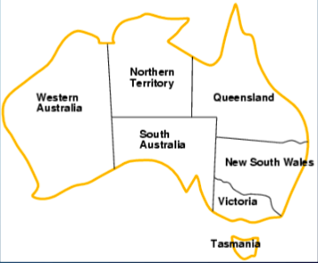
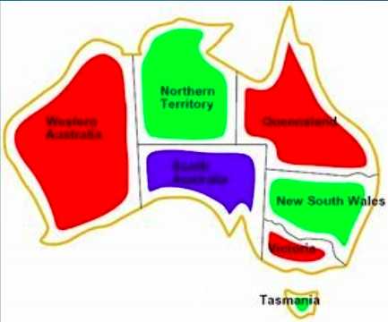
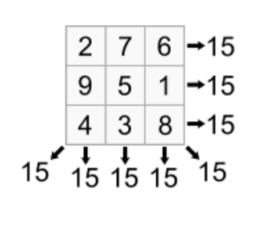

# CSP-Problems-Solutions
This are solutions to simple CSP problems using pyhton.
## Problem 1
In the first problem we will colour the states of Australia ensuring the adjacent states don't share the same colours given.

The diagrams below show how the map is supposed to look after the solution has been passed.

Before

     

After

 

## Problem 2

This problem is about a magic square where An NxN array of integers

where all of rows, columns and diagonals sum to the same number.

In our case given N = 3 and the magic sum = 15 our job is to find the cell values.

## Problem 3

We will solve a sudoku puzzle.

## Problem 4

Battleship puzzle 
NxN grid
• Each cell occupied by
water or part of a ship
• Given
– Ships of varying lengths
– Row and column sums of
number of ship cells
• What are
– variables and domains
– constraints

