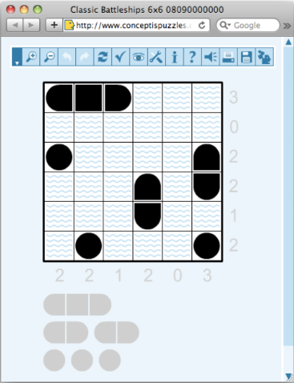
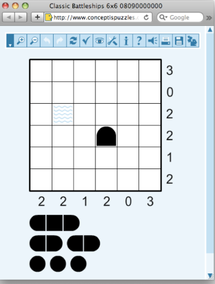

# CSP-Problems-Solutions
This are solutions to simple CSP problems using pyhton notebooks for each puzzle. I found it easier to use notebooks personally you can implement the code as you wish yourself it's all the same. There's a different notebook for each puzzle.

## Problem 1
In the first problem we will colour the states of Australia ensuring the adjacent states don't share the same colours given.

The diagrams below show how the map is supposed to look after the solution has been passed.

Before

     

After

 

## Problem 2

This problem is about a magic square where An NxN array of integers

where all of rows, columns and diagonals sum to the same number.

In our case given N = 3 and the magic sum = 15 our job is to find the cell values.

## Problem 3

We will solve a 9x9 sudoku puzzle using CSP.

## Problem 4

Battleship puzzle which in our case is an NxN grid Each cell occupied by water or part of a ship. Given ships of varying lengths Row and column sums of number of ship cells. Ships can be oriented vertically or horizontally, but not diagonally. 

Ships are not allowed to touch each other, even diagonally. This means that each ship must be surrounded by at least one square of water on all sides and corners. We have to solve this using CSPs.

                               

